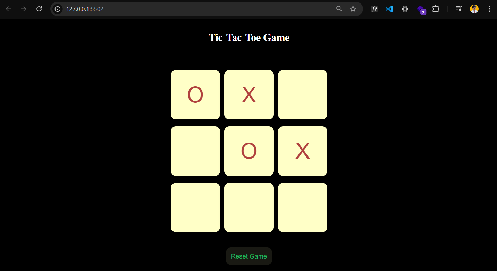

This project implements a classic Tic-Tac-Toe game using HTML, CSS, and JavaScript. The game allows two players to take turns marking spaces on a 3x3 grid until one player achieves a winning combination or the game ends in a draw.

## Demo

You can play the game live [here](https://stellular-biscotti-1e9c47.netlify.app/).



## Features

- Interactive 3x3 grid game board.
- Two-player turn-based gameplay.
- Highlights the winning combination.
- Displays win/loss or draw message.

## Technologies Used

- **HTML**: For structuring the game board and elements.
- **CSS**: For styling the game board and pieces.
- **JavaScript**: For game logic and player interactions.

## Setup

To set up the project locally, follow these steps:

1. Clone the repository:
    ```sh
    git clone https://github.com/susheelvishwa/Tic-tac-toe-game
    ```
2. Navigate to the project directory:
    ```sh
    cd tic-tac-toe
    ```
3. Open `index.html` in your web browser to start the game.

## How to Play

1. Open the game in a web browser.
2. Player 1 (X) and Player 2 (O) take turns clicking on an empty cell in the 3x3 grid.
3. The game will automatically check for a win, loss, or draw condition after each turn.
4. If a player wins, the winning combination will be highlighted, and a message will be displayed.
5. If the game ends in a draw, an appropriate message will be displayed.

## Code Overview

The project consists of three main files:

- `index.html`: Defines the structure of the game board and messages.
- `style.css`: Styles the game board and pieces for a visually appealing experience.
- `script.js`: Handles player interactions, game logic, and win/loss conditions.

## Future Enhancements

- Implement a computer player for single-player mode.
- Add animations for a more engaging user experience.
- Allow customization of player names and symbols.
